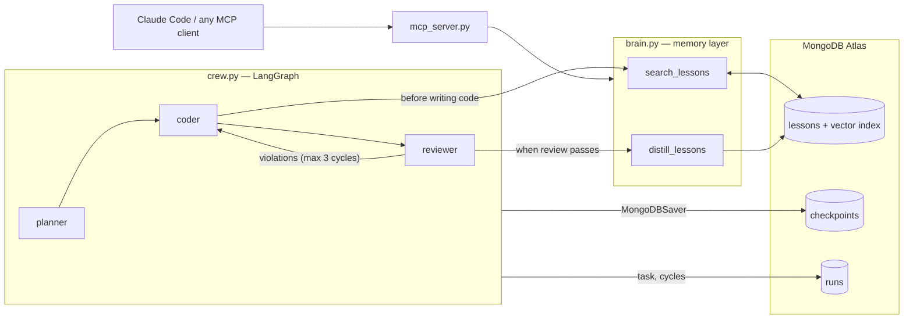

# Repo Brain

**A coding crew that never cold-starts.** Built for the MongoDB Persistent Context Sprint
Hackathon (.Local Build Fest, San Francisco).

A LangGraph crew (planner → coder → reviewer) works tasks on a small FastAPI codebase.
Every reviewer correction is distilled into a **lesson** (convention, past fix, gotcha)
stored in MongoDB Atlas with vector embeddings. On the next task the coder **retrieves
lessons before writing** — so run 2 measurably behaves differently than run 1.

- **Shared brain**: `lessons` collection in Atlas + Vector Search, consumed by every agent
- **Self-improving**: review feedback → lessons → fewer correction cycles on later tasks
- **Crash-proof**: LangGraph MongoDB checkpointer; kill it mid-task and it resumes
- **Portable memory**: a thin MCP server exposes the same brain, so Claude Code (or any
  MCP client) can read what the crew learned

## Status

| Lane | Module | State |
|---|---|---|
| Brain + MCP (Person 1) | `brain.py`, `mcp_server.py` | ✅ built & verified live (branch `brain`) |
| Crew (Person 2) | `crew.py` | ✅ built & verified live (PR #2, merged) |
| Demo CLI (Person 3) | `cli.py` | ✅ built & verified live (PR #1, merged) |

## Architecture



The moving parts, bottom-up:

### 1. The memory layer — `src/repo_brain/brain.py` *(implemented)*

Five functions, and these signatures are a **frozen contract** — the crew and CLI code
against them:

| Function | What it does |
|---|---|
| `embed(text)` | Voyage AI `voyage-3.5-lite`, 1024 dims (pinned in `config.py` — baked into the Atlas index). Retries through the free-tier rate limit (see gotchas). |
| `add_lesson(type_, rule, evidence, source_task)` | Inserts a lesson doc with an embedding computed over `rule`; returns the id. |
| `search_lessons(task_description, k=5)` | `$vectorSearch` against `lessons_vector_index`; returns docs with relevance scores (embedding stripped, `_id` stringified) and `$inc`s each hit's `hit_count` — the demo's "how often is memory actually used" stat. |
| `distill_lessons(review_feedback, source_task)` | One Gemini call (`config.GEMINI_MODEL`) that turns raw reviewer feedback into 0..n durable, repo-general lessons (JSON), stores each via `add_lesson`. Malformed LLM output degrades to `[]`, never crashes the reviewer node. |
| `stats()` | Lesson counts by type, total retrieval hits, and per-task correction cycles read from `runs` — feeds the learning-curve line in the demo. |

The lesson document (also frozen):

```python
{
    "type": "convention" | "past_fix" | "gotcha",
    "rule": "Error responses use the {'error': {'code', 'message'}} envelope",
    "evidence": "<reviewer comment or diff excerpt that produced this lesson>",
    "source_task": "add-items-endpoint",
    "embedding": [...],   # 1024 floats over `rule`
    "hit_count": 0,       # incremented on every retrieval
    "created_at": <datetime>,
}
```

### 2. Atlas collections (db `repo_brain`)

| Collection | Written by | Read by | Purpose |
|---|---|---|---|
| `lessons` | `brain.add_lesson` / `distill_lessons` | `brain.search_lessons`, CLI, MCP | The brain itself. Vector index `lessons_vector_index` (cosine, 1024 dims, filterable by `type`) — created by `scripts/setup_indexes.py`, currently live and queryable. |
| `checkpoints` | LangGraph `MongoDBSaver` | LangGraph on resume | Full graph state per `thread_id`; enables the kill-and-resume demo. |
| `runs` | `crew.run_task` (on finish) | `brain.stats` | `{task, cycles}` history — the run-over-run learning curve. |

### 3. The crew — `src/repo_brain/crew.py` *(implemented)*

`StateGraph` over the frozen state dict
`{task, plan, code, review_feedback, cycles, lessons_used}`:

- **planner** — LLM turns `task` into a short `plan`
- **coder** — calls `brain.search_lessons(task)` *before* writing (recording results in
  `lessons_used`), then produces `code` honoring plan + lessons + prior feedback
- **reviewer** — judges `code` against `demo_target/CONVENTIONS.md`; violations loop
  back to the coder (cap 3); a clean pass triggers `brain.distill_lessons(...)` and ends

Compiled with `MongoDBSaver`, so `run_task(task, thread_id)` resumes a killed run from
its checkpointed node.

### 4. The surfaces

- **`cli.py`** *(implemented)* — `crew run / resume / stats / brain`, Rich-rendered; what the
  judges see.
- **`mcp_server.py`** *(implemented)* — FastMCP over stdio exposing `search_lessons`,
  `add_lesson`, `brain_stats`; each tool is a ~3-line delegate into `brain.py`. Any MCP
  client can query — or teach — the same memory the crew uses.

### 5. The demo fixture — `demo_target/`

A toy FastAPI service with deliberate house conventions (`CONVENTIONS.md`: error
envelope, `handle_<resource>_<verb>` naming, `response_model` on every route, test
naming). The reviewer enforces these; the point of the demo is that the coder stops
needing to be told. Three of these conventions are seeded as hand-written lessons so
retrieval works before the first real distillation.

## Recent changes

### All three lanes merged

PR #2 (crew) merged into `main` on top of PR #1 (CLI) and the `brain` branch. The PR was
written against the pre-brain stubs, so integration fixed the seams between lanes:

- **Config**: the PR still assumed OpenAI embeddings (`text-embedding-3-small`, 1536
  dims). Kept the live Voyage settings (1024 dims) — the Atlas index is built for them —
  and took the PR's `ServerApi("1")`, extra `.env` search paths, and `GEMINI_API_KEY`
  alias. The crew is Gemini-only now; the Anthropic/OpenAI model fallbacks went with the
  deps that were already dropped from `pyproject.toml`.
- **`review_feedback` shape**: the graph keeps only the *current* round in that key (what
  the coder needs), but the CLI renders one panel per cycle. `run_task()` now returns the
  full per-cycle list there, matching `fake_state.py`. Before this, the CLI iterated a
  string and rendered one panel *per character*.
- **Fake brain removed**: `crew.py`'s canned warm lessons fell back silently on any brain
  error, which is indistinguishable from a genuine cold run. Retrieval now fails loudly;
  only `distill_lessons` stays best-effort, so a lesson-writing hiccup can't discard an
  approved run.
- **Resume**: `run_task(task=None, thread_id)` is now the supported resume signature
  (open question 3 in `plans/demo.md`), and an unknown `thread_id` gives a clean CLI
  error instead of silently rendering fixture data.
- Verified live end-to-end: warm `/orders` run retrieved 3 lessons (0.74 / 0.73 / 0.68),
  passed review clean at **0 cycles** with correct `handle_orders_*` names, `api_error`
  envelope, `*Response` models and `test_orders__*` tests; the run persisted to `runs`;
  `resume` replayed it from the checkpoint; `stats` and `brain` render real Atlas data.

### The brain lane (`b23d93a`)

The Person 1 lane landed in `b23d93a` — the first real logic in the repo. Every piece
was verified against the live services, not mocked:

- `brain.py` implemented end-to-end: `embed` returns 1024 floats; `search_lessons` for
  *"add an items endpoint with proper error handling"* returns the seeded conventions
  at scores 0.74 / 0.72 / 0.69 and bumps their `hit_count`; `distill_lessons` turned a
  canned two-cycle review transcript into 2 correct durable lessons; `stats()`
  aggregates it all and tolerates the not-yet-existing `runs` collection.
- `mcp_server.py` implemented and exercised through an in-process FastMCP client
  (all three tools listed and callable).
- Ops done: vector index queryable, `hello_graph.py` checkpoint round-trip passes
  (second run prints "resumed"), 3 conventions seeded (`source_task: "seed"`).
- `plans/brain.md` records the lane plan and its verification commands.

### Gotchas discovered

- **Voyage free-tier keys are limited to 3 requests/minute** until the org adds a
  payment method. `embed()` retries through the window (25 s sleep, 3 attempts) so
  demos stall rather than crash — but add billing before back-to-back rehearsals.
- `langchain-google-genai` returns `.content` as a list of content blocks — use
  `response.text`, don't assume a plain string. (Already handled in `distill_lessons`;
  crew nodes must do the same.)
- `gemini-2.5-flash` is retired; use `config.GEMINI_MODEL` (`gemini-3.7-flash`
  verified working), never a hardcoded model name.
- **The Gemini free tier caps at 20 requests/day *per model*, not just per minute** — one
  full cold run (planner + 3 coder/reviewer rounds + distillation) is ~8 of them, so the
  day's budget is roughly two rehearsals. The daily 429 is unretryable, so `_complete()`
  fails fast on it with a clear message instead of burning 80 s in backoff. The cap being
  per model is also the escape hatch: `GEMINI_MODEL=gemini-3.6-flash` gets a fresh 20.
  Runs are checkpointed, so `crew resume <thread_id>` continues one that hit the wall.

## Layout

```
src/repo_brain/
  config.py      # env + Mongo client — the one place connection details live
  brain.py       # the shared memory layer (lessons: add / distill / search / stats)
  crew.py        # LangGraph graph: planner -> coder -> reviewer
  mcp_server.py  # FastMCP server exposing the brain to external agents
  cli.py         # `crew run "<task>"`, `crew stats`, `crew brain`
scripts/
  setup_indexes.py  # creates the Atlas Vector Search index (run once, before demo)
  hello_graph.py    # smoke test: 2-node graph + MongoDB checkpointer round-trip
plans/              # per-lane implementation plans (written before each lane's code)
demo_target/        # seeded toy FastAPI app the crew operates on (demo fixture)
```

## Setup

```bash
uv sync                       # or: pip install -e .
cp .env.example .env          # fill in MONGODB_URI, VOYAGE_API_KEY, GOOGLE_API_KEY
uv run python scripts/setup_indexes.py
uv run python scripts/hello_graph.py   # verifies Mongo checkpointing works
```

See `TEAM_SPLIT.md` for the lane split, frozen contracts, and timeline;
`DECISIONS.md` for the pre-event scoping decisions.

## Hackathon provenance

Committed **before** the event (per the rules, so judges can see the boundary):
project scaffolding, dependencies, this README, the Atlas index setup script, the
`hello_graph.py` smoke test, the seeded demo fixture in `demo_target/`, and **empty
stubs** in `src/repo_brain/` (signatures + TODOs only, no logic).

Built **during** the event: everything that makes this interesting — the lesson
schema/distillation, vector retrieval, the planner/coder/reviewer graph, checkpoint
resume wiring, the MCP server, and the demo CLI.

Patterns were studied (not copied) from MongoDB's
[GenAI-Showcase](https://github.com/mongodb-developer/GenAI-Showcase) (MIT), the
official starter resource for this hackathon.
